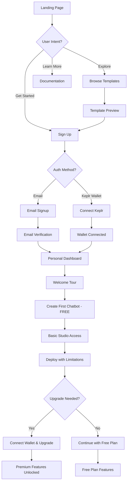
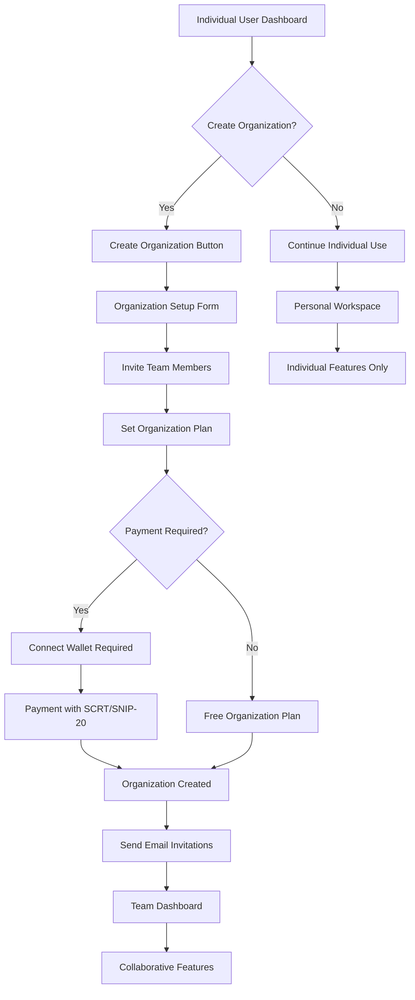
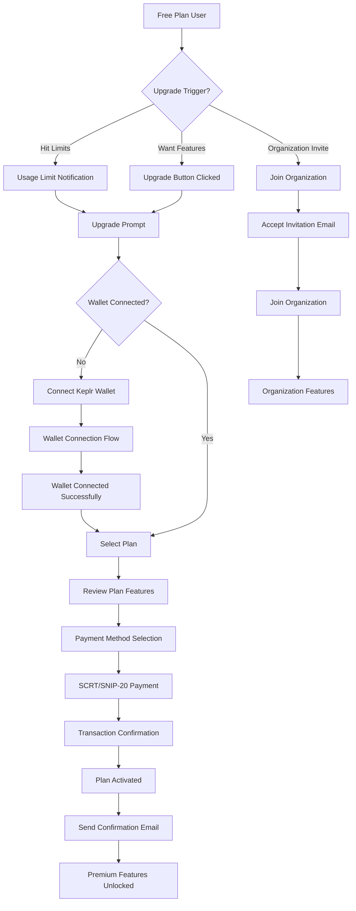
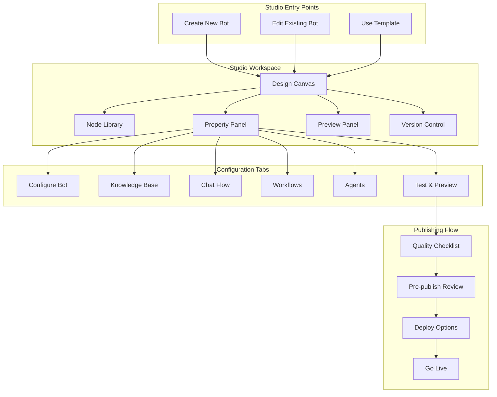
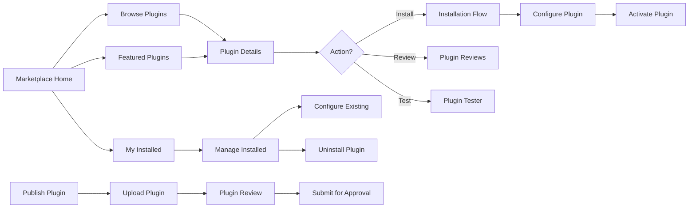
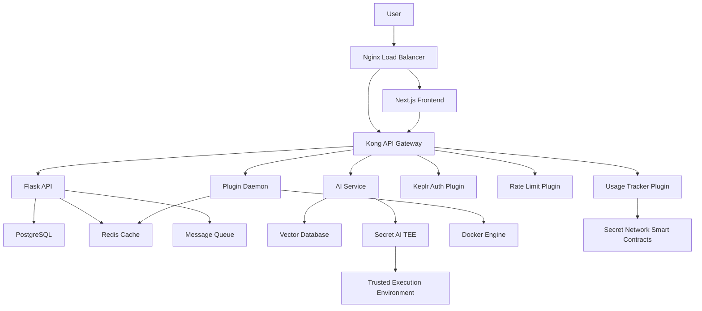

# PrivexBot: Complete Architecture Guide
## Building a Privacy-First AI Chatbot Platform

---

## Table of Contents
1. [Architecture Philosophy](#architecture-philosophy)
2. [Complete Project Structure](#complete-project-structure)
3. [Understanding Multitenancy](#understanding-multitenancy)
4. [Containerization Strategy](#containerization-strategy)
5. [Service Architecture & Data Flow](#service-architecture--data-flow)
6. [Secret AI Integration as Plugin](#secret-ai-integration-as-plugin)
7. [Keplr Wallet & Blockchain Integration](#keplr-wallet--blockchain-integration)
8. [Implementation Roadmap](#implementation-roadmap)
9. [Deployment Strategy](#deployment-strategy)
10. [Technical Deep Dives](#technical-deep-dives)

---

## Architecture Philosophy

### Why We Build This Way

**PrivexBot follows these principles:**

1. **Separation of Concerns**: Each service has ONE job and does it well
2. **Privacy by Design**: Every piece of data is encrypted and isolated
3. **Scalability**: Each service can grow independently
4. **Maintainability**: You can update one part without breaking others
5. **Security**: Multiple layers of protection

### The Three Core Principles

- **Privacy (Priv)**: All data processing happens in Secret Network's Trusted Execution Environment (TEE)
- **Execution (Ex)**: Efficient, secure AI processing 
- **Bot**: User-friendly chatbot functionality

---

## Complete Project Structure

```
privexbot/
├── README.md
├── docker-compose.yml                     # Orchestrates all services
├── docker-compose.dev.yml                # Development environment
├── docker-compose.prod.yml               # Production environment
├── .env.example                          # Environment variables template
├── .gitignore
├── LICENSE
├── CONTRIBUTING.md
│
├── frontend/                             # Next.js 15 React Frontend
│   ├── package.json
│   ├── package-lock.json
│   ├── next.config.js
│   ├── tailwind.config.js
│   ├── tsconfig.json
│   ├── Dockerfile
│   ├── public/
│   │   ├── icons/
│   │   ├── images/
│   │   ├── illustrations/
│   │   └── robots.txt
│   ├── src/
│   │   ├── app/                          # Next.js 15 App Router
│   │   │   ├── layout.tsx                # Root layout with wallet provider
│   │   │   ├── page.tsx                  # Landing page
│   │   │   ├── globals.css
│   │   │   ├── not-found.tsx             # 404 page
│   │   │   │
│   │   │   ├── auth/                     # Authentication pages
│   │   │   │   ├── signin/
│   │   │   │   │   ├── page.tsx          # Sign in with Keplr/Email
│   │   │   │   │   └── loading.tsx
│   │   │   │   ├── signup/
│   │   │   │   │   ├── page.tsx          # Sign up flow
│   │   │   │   │   └── verify/page.tsx   # Email verification
│   │   │   │   ├── forgot-password/
│   │   │   │   │   └── page.tsx
│   │   │   │   └── connect-wallet/
│   │   │   │       └── page.tsx          # Keplr wallet connection
│   │   │   │
│   │   │   ├── dashboard/                # Individual user dashboard
│   │   │   │   ├── page.tsx              # Personal dashboard
│   │   │   │   ├── layout.tsx            # Personal layout with sidebar
│   │   │   │   ├── studio/               # Personal studio
│   │   │   │   │   ├── page.tsx          # Personal studio home
│   │   │   │   │   ├── [botId]/          # Personal chatbot studio
│   │   │   │   │   │   ├── page.tsx      # Studio interface
│   │   │   │   │   │   ├── design/       # Design interface
│   │   │   │   │   │   ├── configure/    # Configuration
│   │   │   │   │   │   ├── knowledge/    # Knowledge base
│   │   │   │   │   │   ├── test/         # Testing interface
│   │   │   │   │   │   └── publish/      # Publishing
│   │   │   │   │   └── templates/        # Template gallery
│   │   │   │   ├── chatbots/             # Personal chatbots
│   │   │   │   │   ├── page.tsx          # My chatbots list
│   │   │   │   │   ├── create/           # Create new chatbot
│   │   │   │   │   └── [botId]/          # Chatbot management
│   │   │   │   ├── marketplace/          # Plugin marketplace
│   │   │   │   │   ├── page.tsx          # Marketplace home
│   │   │   │   │   ├── explore/          # Browse plugins
│   │   │   │   │   ├── installed/        # My plugins
│   │   │   │   │   └── [pluginId]/       # Plugin details
│   │   │   │   ├── billing/              # Personal billing
│   │   │   │   │   ├── page.tsx          # Billing overview
│   │   │   │   │   ├── upgrade/          # Upgrade plans
│   │   │   │   │   ├── usage/            # Usage tracking
│   │   │   │   │   └── payments/         # Payment history
│   │   │   │   ├── analytics/            # Personal analytics
│   │   │   │   │   ├── page.tsx          # Analytics dashboard
│   │   │   │   │   ├── usage/            # Usage analytics
│   │   │   │   │   └── reports/          # Custom reports
│   │   │   │   ├── profile/              # User profile
│   │   │   │   │   ├── page.tsx          # Profile overview
│   │   │   │   │   ├── settings/         # Profile settings
│   │   │   │   │   ├── wallet/           # Wallet management
│   │   │   │   │   ├── notifications/    # Notification settings
│   │   │   │   │   └── security/         # Security settings
│   │   │   │   └── organizations/        # Organization management
│   │   │   │       ├── page.tsx          # My organizations
│   │   │   │       ├── create/           # Create organization
│   │   │   │       │   ├── page.tsx      # Organization setup
│   │   │   │       │   ├── plan/         # Choose plan
│   │   │   │       │   ├── payment/      # Payment setup
│   │   │   │       │   └── invite/       # Invite team
│   │   │   │       ├── invitations/      # Organization invitations
│   │   │   │       │   ├── page.tsx      # Pending invitations
│   │   │   │       │   └── [inviteId]/   # Accept/decline invite
│   │   │   │       └── switch/           # Switch context
│   │   │   │
│   │   │   ├── workspace/                # Organization workspace
│   │   │   │   ├── page.tsx              # Workspace selector
│   │   │   │   ├── layout.tsx            # Workspace layout with sidebar
│   │   │   │   ├── [orgId]/              # Organization-scoped routes
│   │   │   │   │   ├── page.tsx          # Workspace dashboard
│   │   │   │   │   ├── loading.tsx
│   │   │   │   │   │
│   │   │   │   │   ├── studio/           # Chatbot Studio (Main Builder)
│   │   │   │   │   │   ├── page.tsx      # Studio home/templates
│   │   │   │   │   │   ├── [botId]/
│   │   │   │   │   │   │   ├── page.tsx  # Main studio interface
│   │   │   │   │   │   │   ├── layout.tsx # Studio layout with panels
│   │   │   │   │   │   │   ├── draft/
│   │   │   │   │   │   │   │   └── page.tsx # Draft workspace
│   │   │   │   │   │   │   ├── design/
│   │   │   │   │   │   │   │   ├── page.tsx # Visual flow designer
│   │   │   │   │   │   │   │   ├── orchestrate/
│   │   │   │   │   │   │   │   │   └── page.tsx # Workflow orchestration
│   │   │   │   │   │   │   │   ├── nodes/
│   │   │   │   │   │   │   │   │   └── page.tsx # Node management
│   │   │   │   │   │   │   │   └── tools/
│   │   │   │   │   │   │   │       └── page.tsx # Tool configuration
│   │   │   │   │   │   │   ├── configure/
│   │   │   │   │   │   │   │   ├── page.tsx # Bot configuration
│   │   │   │   │   │   │   │   ├── personality/
│   │   │   │   │   │   │   │   │   └── page.tsx # Personality settings
│   │   │   │   │   │   │   │   ├── features/
│   │   │   │   │   │   │   │   │   └── page.tsx # Feature toggles
│   │   │   │   │   │   │   │   ├── environment/
│   │   │   │   │   │   │   │   │   └── page.tsx # Environment variables
│   │   │   │   │   │   │   │   └── advanced/
│   │   │   │   │   │   │   │       └── page.tsx # Advanced settings
│   │   │   │   │   │   │   ├── knowledge/
│   │   │   │   │   │   │   │   ├── page.tsx # Knowledge management
│   │   │   │   │   │   │   │   ├── create/
│   │   │   │   │   │   │   │   │   └── page.tsx # Create knowledge base
│   │   │   │   │   │   │   │   ├── datasources/
│   │   │   │   │   │   │   │   │   ├── page.tsx # Data source management
│   │   │   │   │   │   │   │   │   ├── upload/
│   │   │   │   │   │   │   │   │   │   └── page.tsx # File upload
│   │   │   │   │   │   │   │   │   ├── web/
│   │   │   │   │   │   │   │   │   │   └── page.tsx # Website crawling
│   │   │   │   │   │   │   │   │   └── api/
│   │   │   │   │   │   │   │   │       └── page.tsx # API integration
│   │   │   │   │   │   │   │   ├── processing/
│   │   │   │   │   │   │   │   │   └── page.tsx # Document processing
│   │   │   │   │   │   │   │   └── annotation/
│   │   │   │   │   │   │   │       └── page.tsx # Data annotation
│   │   │   │   │   │   │   ├── chatflow/
│   │   │   │   │   │   │   │   ├── page.tsx # Conversation flow design
│   │   │   │   │   │   │   │   ├── builder/
│   │   │   │   │   │   │   │   │   └── page.tsx # Flow builder interface
│   │   │   │   │   │   │   │   └── conditions/
│   │   │   │   │   │   │   │       └── page.tsx # Conditional logic
│   │   │   │   │   │   │   ├── workflow/
│   │   │   │   │   │   │   │   ├── page.tsx # Workflow management
│   │   │   │   │   │   │   │   ├── automation/
│   │   │   │   │   │   │   │   │   └── page.tsx # Automation rules
│   │   │   │   │   │   │   │   └── triggers/
│   │   │   │   │   │   │   │       └── page.tsx # Event triggers
│   │   │   │   │   │   │   ├── agents/
│   │   │   │   │   │   │   │   ├── page.tsx # Chat agent management
│   │   │   │   │   │   │   │   ├── create/
│   │   │   │   │   │   │   │   │   └── page.tsx # Create new agent
│   │   │   │   │   │   │   │   └── [agentId]/
│   │   │   │   │   │   │   │       └── page.tsx # Agent configuration
│   │   │   │   │   │   │   ├── test/
│   │   │   │   │   │   │   │   ├── page.tsx # Test interface
│   │   │   │   │   │   │   │   ├── preview/
│   │   │   │   │   │   │   │   │   └── page.tsx # Live preview
│   │   │   │   │   │   │   │   ├── conversation/
│   │   │   │   │   │   │   │   │   └── page.tsx # Conversation testing
│   │   │   │   │   │   │   │   └── scenarios/
│   │   │   │   │   │   │   │       └── page.tsx # Test scenarios
│   │   │   │   │   │   │   ├── version/
│   │   │   │   │   │   │   │   ├── page.tsx # Version history
│   │   │   │   │   │   │   │   ├── compare/
│   │   │   │   │   │   │   │   │   └── page.tsx # Version comparison
│   │   │   │   │   │   │   │   └── restore/
│   │   │   │   │   │   │   │       └── page.tsx # Version restore
│   │   │   │   │   │   │   ├── checklist/
│   │   │   │   │   │   │   │   └── page.tsx # Quality checklist/issues
│   │   │   │   │   │   │   ├── publish/
│   │   │   │   │   │   │   │   ├── page.tsx # Publish interface
│   │   │   │   │   │   │   │   ├── review/
│   │   │   │   │   │   │   │   │   └── page.tsx # Pre-publish review
│   │   │   │   │   │   │   │   └── deploy/
│   │   │   │   │   │   │   │       └── page.tsx # Deployment options
│   │   │   │   │   │   │   └── execute/
│   │   │   │   │   │   │       └── page.tsx # Execution monitoring
│   │   │   │   │   │   └── templates/
│   │   │   │   │   │       ├── page.tsx # Template gallery
│   │   │   │   │   │       ├── [templateId]/
│   │   │   │   │   │       │   └── page.tsx # Template details
│   │   │   │   │   │       └── create/
│   │   │   │   │   │           └── page.tsx # Create from template
│   │   │   │   │   │
│   │   │   │   │   ├── chatbots/          # Chatbot Management
│   │   │   │   │   │   ├── page.tsx       # All chatbots overview
│   │   │   │   │   │   ├── create/
│   │   │   │   │   │   │   ├── page.tsx   # Create new chatbot
│   │   │   │   │   │   │   ├── blank/
│   │   │   │   │   │   │   │   └── page.tsx # Create from scratch
│   │   │   │   │   │   │   └── template/
│   │   │   │   │   │   │       └── page.tsx # Create from template
│   │   │   │   │   │   └── [botId]/
│   │   │   │   │   │       ├── page.tsx   # Bot details/overview
│   │   │   │   │   │       ├── settings/
│   │   │   │   │   │       │   ├── page.tsx # Bot settings
│   │   │   │   │   │       │   ├── general/
│   │   │   │   │   │       │   │   └── page.tsx # General settings
│   │   │   │   │   │       │   ├── security/
│   │   │   │   │   │       │   │   └── page.tsx # Security settings
│   │   │   │   │   │       │   └── integrations/
│   │   │   │   │   │       │       └── page.tsx # Platform integrations
│   │   │   │   │   │       ├── analytics/
│   │   │   │   │   │       │   ├── page.tsx # Analytics dashboard
│   │   │   │   │   │       │   ├── conversations/
│   │   │   │   │   │       │   │   └── page.tsx # Conversation analytics
│   │   │   │   │   │       │   ├── performance/
│   │   │   │   │   │       │   │   └── page.tsx # Performance metrics
│   │   │   │   │   │       │   └── reports/
│   │   │   │   │   │       │       └── page.tsx # Custom reports
│   │   │   │   │   │       ├── monitoring/
│   │   │   │   │   │       │   ├── page.tsx # Real-time monitoring
│   │   │   │   │   │       │   ├── logs/
│   │   │   │   │   │       │   │   └── page.tsx # System logs
│   │   │   │   │   │       │   ├── errors/
│   │   │   │   │   │       │   │   └── page.tsx # Error tracking
│   │   │   │   │   │       │   └── health/
│   │   │   │   │   │       │       └── page.tsx # Health checks
│   │   │   │   │   │       └── api-access/
│   │   │   │   │   │           ├── page.tsx # API management
│   │   │   │   │   │           ├── keys/
│   │   │   │   │   │           │   └── page.tsx # API key management
│   │   │   │   │   │           ├── documentation/
│   │   │   │   │   │           │   └── page.tsx # API docs
│   │   │   │   │   │           └── webhooks/
│   │   │   │   │   │               └── page.tsx # Webhook configuration
│   │   │   │   │   │
│   │   │   │   │   ├── marketplace/       # Plugin Marketplace
│   │   │   │   │   │   ├── page.tsx       # Marketplace home
│   │   │   │   │   │   ├── explore/
│   │   │   │   │   │   │   ├── page.tsx   # Browse all plugins
│   │   │   │   │   │   │   ├── featured/
│   │   │   │   │   │   │   │   └── page.tsx # Featured plugins
│   │   │   │   │   │   │   ├── categories/
│   │   │   │   │   │   │   │   └── [category]/
│   │   │   │   │   │   │   │       └── page.tsx # Category view
│   │   │   │   │   │   │   └── search/
│   │   │   │   │   │   │       └── page.tsx # Search results
│   │   │   │   │   │   ├── installed/
│   │   │   │   │   │   │   ├── page.tsx   # Installed plugins
│   │   │   │   │   │   │   └── [pluginId]/
│   │   │   │   │   │   │       ├── page.tsx # Plugin details
│   │   │   │   │   │   │       ├── configure/
│   │   │   │   │   │   │       │   └── page.tsx # Plugin configuration
│   │   │   │   │   │   │       └── test/
│   │   │   │   │   │   │           └── page.tsx # Test plugin
│   │   │   │   │   │   ├── publish/
│   │   │   │   │   │   │   ├── page.tsx   # Publish plugin
│   │   │   │   │   │   │   ├── upload/
│   │   │   │   │   │   │   │   └── page.tsx # Upload plugin
│   │   │   │   │   │   │   ├── review/
│   │   │   │   │   │   │   │   └── page.tsx # Plugin review
│   │   │   │   │   │   │   └── submit/
│   │   │   │   │   │   │       └── page.tsx # Submit for approval
│   │   │   │   │   │   └── [pluginId]/
│   │   │   │   │   │       ├── page.tsx   # Plugin detail view
│   │   │   │   │   │       ├── install/
│   │   │   │   │   │       │   └── page.tsx # Install plugin
│   │   │   │   │   │       ├── reviews/
│   │   │   │   │   │       │   └── page.tsx # Plugin reviews
│   │   │   │   │   │       └── changelog/
│   │   │   │   │   │           └── page.tsx # Plugin changelog
│   │   │   │   │   │
│   │   │   │   │   ├── analytics/         # Organization Analytics
│   │   │   │   │   │   ├── page.tsx       # Analytics dashboard
│   │   │   │   │   │   ├── usage/
│   │   │   │   │   │   │   ├── page.tsx   # Usage analytics
│   │   │   │   │   │   │   ├── tokens/
│   │   │   │   │   │   │   │   └── page.tsx # Token usage
│   │   │   │   │   │   │   └── api/
│   │   │   │   │   │   │       └── page.tsx # API usage
│   │   │   │   │   │   ├── billing/
│   │   │   │   │   │   │   ├── page.tsx   # Billing overview
│   │   │   │   │   │   │   ├── payments/
│   │   │   │   │   │   │   │   └── page.tsx # Payment history
│   │   │   │   │   │   │   ├── staking/
│   │   │   │   │   │   │   │   └── page.tsx # SCRT staking
│   │   │   │   │   │   │   └── invoices/
│   │   │   │   │   │   │       └── page.tsx # Invoice management
│   │   │   │   │   │   └── reports/
│   │   │   │   │   │       ├── page.tsx   # Custom reports
│   │   │   │   │   │       ├── export/
│   │   │   │   │   │       │   └── page.tsx # Data export
│   │   │   │   │   │       └── scheduled/
│   │   │   │   │   │           └── page.tsx # Scheduled reports
│   │   │   │   │   │
│   │   │   │   │   ├── settings/          # Organization Settings
│   │   │   │   │   │   ├── page.tsx       # General settings
│   │   │   │   │   │   ├── members/
│   │   │   │   │   │   │   ├── page.tsx   # Team management
│   │   │   │   │   │   │   ├── invite/
│   │   │   │   │   │   │   │   └── page.tsx # Invite members
│   │   │   │   │   │   │   └── roles/
│   │   │   │   │   │   │       └── page.tsx # Role management
│   │   │   │   │   │   ├── security/
│   │   │   │   │   │   │   ├── page.tsx   # Security settings
│   │   │   │   │   │   │   ├── api-keys/
│   │   │   │   │   │   │   │   └── page.tsx # API key management
│   │   │   │   │   │   │   └── audit/
│   │   │   │   │   │   │       └── page.tsx # Audit logs
│   │   │   │   │   │   ├── billing/
│   │   │   │   │   │   │   ├── page.tsx   # Billing settings
│   │   │   │   │   │   │   ├── subscription/
│   │   │   │   │   │   │   │   └── page.tsx # Subscription management
│   │   │   │   │   │   │   └── payment-methods/
│   │   │   │   │   │   │       └── page.tsx # Payment methods
│   │   │   │   │   │   └── integration/
│   │   │   │   │   │       ├── page.tsx   # Integration settings
│   │   │   │   │   │       ├── webhooks/
│   │   │   │   │   │       │   └── page.tsx # Webhook configuration
│   │   │   │   │   │       └── api/
│   │   │   │   │   │           └── page.tsx # API configuration
│   │   │   │   │   │
│   │   │   │   │   └── profile/           # User Profile (org context)
│   │   │   │   │       ├── page.tsx       # Profile overview
│   │   │   │   │       ├── settings/
│   │   │   │   │       │   ├── page.tsx   # Profile settings
│   │   │   │   │       │   ├── preferences/
│   │   │   │   │       │   │   └── page.tsx # User preferences
│   │   │   │   │       │   └── notifications/
│   │   │   │   │       │       └── page.tsx # Notification settings
│   │   │   │   │       ├── wallet/
│   │   │   │   │       │   ├── page.tsx   # Wallet management
│   │   │   │   │       │   ├── connect/
│   │   │   │   │       │   │   └── page.tsx # Connect new wallet
│   │   │   │   │       │   ├── tokens/
│   │   │   │   │       │   │   └── page.tsx # Token management
│   │   │   │   │       │   └── transactions/
│   │   │   │   │       │       └── page.tsx # Transaction history
│   │   │   │   │       └── organizations/
│   │   │   │   │           ├── page.tsx   # Organization membership
│   │   │   │   │           ├── create/
│   │   │   │   │           │   └── page.tsx # Create organization
│   │   │   │   │           └── switch/
│   │   │   │   │               └── page.tsx # Switch organization
│   │   │   │   │
│   │   │   │   └── new/                   # Create organization
│   │   │   │       └── page.tsx
│   │   │   │
│   │   │   ├── explore/                   # Public exploration (no auth)
│   │   │   │   ├── page.tsx               # Explore home
│   │   │   │   ├── templates/
│   │   │   │   │   ├── page.tsx           # Public templates
│   │   │   │   │   └── [templateId]/
│   │   │   │   │       └── page.tsx       # Template preview
│   │   │   │   ├── showcase/
│   │   │   │   │   ├── page.tsx           # Bot showcase
│   │   │   │   │   └── [botId]/
│   │   │   │   │       └── page.tsx       # Bot demo
│   │   │   │   └── plugins/
│   │   │   │       ├── page.tsx           # Public plugin directory
│   │   │   │       └── [pluginId]/
│   │   │   │           └── page.tsx       # Plugin information
│   │   │   │
│   │   │   ├── pricing/                   # Pricing page
│   │   │   │   └── page.tsx
│   │   │   │
│   │   │   ├── docs/                      # Documentation
│   │   │   │   ├── page.tsx               # Documentation home
│   │   │   │   ├── getting-started/
│   │   │   │   │   └── page.tsx
│   │   │   │   ├── api/
│   │   │   │   │   └── page.tsx
│   │   │   │   └── guides/
│   │   │   │       └── page.tsx
│   │   │   └── api/                      # API routes
│   │   │       ├── auth/
│   │   │       │   ├── login/route.ts
│   │   │       │   ├── register/route.ts
│   │   │       │   └── refresh/route.ts
│   │   │       ├── webhooks/
│   │   │       │   ├── discord/route.ts
│   │   │       │   ├── slack/route.ts
│   │   │       │   └── whatsapp/route.ts
│   │   │       └── proxy/
│   │   │           └── chat/route.ts
│   │   ├── components/                   # Reusable UI components
│   │   │   ├── ui/                       # shadcn/ui components
│   │   │   │   ├── button.tsx
│   │   │   │   ├── card.tsx
│   │   │   │   ├── dialog.tsx
│   │   │   │   ├── form.tsx
│   │   │   │   ├── input.tsx
│   │   │   │   └── toast.tsx
│   │   │   ├── wallet/                   # Keplr wallet integration
│   │   │   │   ├── WalletConnect.tsx      # Main wallet connection component
│   │   │   │   ├── WalletBalance.tsx      # Display wallet balances
│   │   │   │   ├── PaymentModal.tsx       # SCRT/SNIP-20 payment interface
│   │   │   │   ├── StakingInterface.tsx   # SCRT staking for pro features
│   │   │   │   ├── TokenSelector.tsx      # Token selection dropdown
│   │   │   │   └── TransactionHistory.tsx # Transaction history display
│   │   │   │
│   │   │   ├── studio/                   # Studio-specific components
│   │   │   │   ├── FlowCanvas.tsx         # Main flow design canvas
│   │   │   │   ├── NodeLibrary.tsx        # Draggable node library
│   │   │   │   ├── NodeEditor.tsx         # Node configuration panel
│   │   │   │   ├── PropertyPanel.tsx      # Properties sidebar
│   │   │   │   ├── StudioToolbar.tsx      # Studio toolbar with actions
│   │   │   │   ├── PreviewPanel.tsx       # Live chatbot preview
│   │   │   │   ├── VersionControl.tsx     # Version management UI
│   │   │   │   ├── PublishModal.tsx       # Publish/deploy modal
│   │   │   │   ├── ChecklistSidebar.tsx   # Quality checklist
│   │   │   │   ├── EnvironmentVars.tsx    # Environment variable editor
│   │   │   │   ├── FeatureToggles.tsx     # Feature configuration toggles
│   │   │   │   ├── PersonalityConfig.tsx  # Bot personality settings
│   │   │   │   ├── WorkflowOrchestrator.tsx # Workflow design interface
│   │   │   │   ├── AgentBuilder.tsx       # Chat agent configuration
│   │   │   │   ├── KnowledgeManager.tsx   # Knowledge base management
│   │   │   │   ├── DataAnnotation.tsx     # Data annotation interface
│   │   │   │   ├── TestInterface.tsx      # Chatbot testing interface
│   │   │   │   ├── ConversationTester.tsx # Conversation flow testing
│   │   │   │   ├── ScenarioBuilder.tsx    # Test scenario builder
│   │   │   │   └── ExecutionMonitor.tsx   # Live execution monitoring
│   │   │   │
│   │   │   ├── chatbot/                  # Chatbot management components
│   │   │   │   ├── ChatInterface.tsx      # Interactive chat component
│   │   │   │   ├── BotCard.tsx           # Chatbot overview card
│   │   │   │   ├── BotGrid.tsx           # Grid layout for multiple bots
│   │   │   │   ├── TrainingProgress.tsx   # Training status display
│   │   │   │   ├── AnalyticsDashboard.tsx # Analytics charts and metrics
│   │   │   │   ├── DeploymentStatus.tsx   # Deployment status indicators
│   │   │   │   ├── UsageMetrics.tsx       # Usage statistics component
│   │   │   │   ├── PerformanceChart.tsx   # Performance visualization
│   │   │   │   ├── ConversationList.tsx   # List of conversations
│   │   │   │   ├── MessageAnnotation.tsx  # Message annotation interface
│   │   │   │   └── BotSettings.tsx        # Bot configuration form
│   │   │   │
│   │   │   ├── marketplace/              # Marketplace components
│   │   │   │   ├── PluginCard.tsx         # Plugin overview card
│   │   │   │   ├── PluginGrid.tsx         # Grid of plugins
│   │   │   │   ├── PluginDetail.tsx       # Detailed plugin view
│   │   │   │   ├── InstallModal.tsx       # Plugin installation modal
│   │   │   │   ├── PluginConfig.tsx       # Plugin configuration interface
│   │   │   │   ├── ReviewsSection.tsx     # Plugin reviews and ratings
│   │   │   │   ├── PublishPlugin.tsx      # Plugin publishing form
│   │   │   │   ├── CategoryFilter.tsx     # Plugin category filtering
│   │   │   │   ├── SearchFilter.tsx       # Plugin search interface
│   │   │   │   ├── InstalledPlugins.tsx   # Manage installed plugins
│   │   │   │   └── PluginTester.tsx       # Plugin testing interface
│   │   │   │
│   │   │   ├── knowledge/                # Knowledge management components
│   │   │   │   ├── DataSourceUpload.tsx   # File upload interface
│   │   │   │   ├── WebCrawler.tsx         # Website crawling configuration
│   │   │   │   ├── DocumentProcessor.tsx  # Document processing interface
│   │   │   │   ├── KnowledgeBase.tsx      # Knowledge base overview
│   │   │   │   ├── AnnotationTool.tsx     # Data annotation interface
│   │   │   │   ├── ProcessingQueue.tsx    # Document processing queue
│   │   │   │   ├── SourceManager.tsx      # Data source management
│   │   │   │   └── VectorVisualization.tsx # Vector embeddings visualization
│   │   │   │
│   │   │   ├── analytics/                # Analytics components
│   │   │   │   ├── DashboardOverview.tsx  # Main analytics dashboard
│   │   │   │   ├── UsageChart.tsx         # Usage trend charts
│   │   │   │   ├── TokenUsageChart.tsx    # Token consumption charts
│   │   │   │   ├── BillingOverview.tsx    # Billing summary component
│   │   │   │   ├── ConversationAnalytics.tsx # Conversation insights
│   │   │   │   ├── PerformanceMetrics.tsx # System performance metrics
│   │   │   │   ├── ReportBuilder.tsx      # Custom report builder
│   │   │   │   ├── DataExporter.tsx       # Data export interface
│   │   │   │   └── AlertsPanel.tsx        # Monitoring alerts panel
│   │   │   │
│   │   │   ├── organization/             # Organization management components
│   │   │   │   ├── OrgSelector.tsx        # Organization switcher
│   │   │   │   ├── MemberManagement.tsx   # Team member management
│   │   │   │   ├── RoleEditor.tsx         # Role and permissions editor
│   │   │   │   ├── InviteModal.tsx        # Team invitation modal
│   │   │   │   ├── BillingSettings.tsx    # Billing configuration
│   │   │   │   ├── SecuritySettings.tsx   # Security configuration
│   │   │   │   ├── APIKeyManager.tsx      # API key management
│   │   │   │   ├── WebhookConfig.tsx      # Webhook configuration
│   │   │   │   ├── AuditLog.tsx           # Audit log viewer
│   │   │   │   └── IntegrationSettings.tsx # Platform integrations
│   │   │   │
│   │   │   ├── shared/                   # Shared/common components
│   │   │   │   ├── Header.tsx             # Main application header
│   │   │   │   ├── Sidebar.tsx            # Navigation sidebar
│   │   │   │   ├── WorkspaceSwitcher.tsx  # Workspace/org switcher
│   │   │   │   ├── BreadcrumbNav.tsx      # Breadcrumb navigation
│   │   │   │   ├── Loading.tsx            # Loading states
│   │   │   │   ├── ErrorBoundary.tsx      # Error handling
│   │   │   │   ├── EmptyState.tsx         # Empty state illustrations
│   │   │   │   ├── ConfirmModal.tsx       # Confirmation dialogs
│   │   │   │   ├── NotificationPanel.tsx  # In-app notifications
│   │   │   │   ├── SearchBar.tsx          # Global search component
│   │   │   │   ├── FilterPanel.tsx        # Filtering interface
│   │   │   │   ├── PaginationControls.tsx # Pagination component
│   │   │   │   ├── StatusIndicator.tsx    # Status badges and indicators
│   │   │   │   ├── CopyToClipboard.tsx    # Copy functionality
│   │   │   │   ├── DateRangePicker.tsx    # Date range selection
│   │   │   │   ├── FileUpload.tsx         # File upload component
│   │   │   │   ├── CodeEditor.tsx         # Code/JSON editor
│   │   │   │   ├── MarkdownRenderer.tsx   # Markdown display
│   │   │   │   └── TooltipInfo.tsx        # Information tooltips
│   │   ├── lib/                          # Utility functions
│   │   │   ├── auth.ts                   # Authentication utilities
│   │   │   ├── api.ts                    # API client configuration
│   │   │   ├── wallet.ts                 # Keplr wallet utilities
│   │   │   ├── secret-network.ts         # Secret Network client
│   │   │   ├── utils.ts                  # General utilities
│   │   │   ├── constants.ts              # Application constants
│   │   │   └── validators.ts             # Form validation schemas
│   │   ├── hooks/                        # Custom React hooks
│   │   │   ├── use-auth.ts               # Authentication hook
│   │   │   ├── use-wallet.ts             # Wallet connection hook
│   │   │   ├── use-organization.ts       # Organization management hook
│   │   │   ├── use-secret-network.ts     # Secret Network integration hook
│   │   │   ├── use-chatbot.ts            # Chatbot management hook
│   │   │   └── use-deployment.ts         # Deployment management hook
│   │   ├── store/                        # Zustand state management
│   │   │   ├── auth.ts                   # Authentication state
│   │   │   ├── wallet.ts                 # Wallet state
│   │   │   ├── organization.ts           # Organization state
│   │   │   ├── chatbot.ts                # Chatbot state
│   │   │   └── ui.ts                     # UI state (modals, etc.)
│   │   └── types/                        # TypeScript type definitions
│   │       ├── auth.ts                   # Authentication types
│   │       ├── chatbot.ts                # Chatbot types
│   │       ├── organization.ts           # Organization types
│   │       ├── secret-network.ts         # Blockchain types
│   │       ├── api.ts                    # API response types
│   │       └── global.d.ts               # Global type declarations
│   └── tests/
│       ├── __mocks__/                    # Test mocks
│       ├── components/                   # Component tests
│       ├── pages/                        # Page tests
│       ├── utils/                        # Utility function tests
│       └── setup.ts                      # Test setup configuration
│
├── backend/                              # Python Flask Backend API
│   ├── requirements.txt                  # Production dependencies
│   ├── requirements-dev.txt              # Development dependencies
│   ├── pyproject.toml                    # Python project configuration
│   ├── Dockerfile                        # Container configuration
│   ├── app.py                            # Main Flask application
│   ├── wsgi.py                           # WSGI entry point
│   ├── config/
│   │   ├── __init__.py
│   │   ├── development.py                # Development configuration
│   │   ├── production.py                 # Production configuration
│   │   └── testing.py                    # Testing configuration
│   ├── api/                              # API layer (Flask routes)
│   │   ├── __init__.py
│   │   ├── auth/                         # Authentication endpoints
│   │   │   ├── __init__.py
│   │   │   ├── routes.py                 # Login, register, refresh routes
│   │   │   └── decorators.py             # Auth decorators
│   │   ├── organizations/                # Organization management
│   │   │   ├── __init__.py
│   │   │   ├── routes.py                 # CRUD operations for orgs
│   │   │   └── models.py                 # Pydantic models
│   │   ├── chatbots/                     # Chatbot management
│   │   │   ├── __init__.py
│   │   │   ├── routes.py                 # Chatbot CRUD operations
│   │   │   ├── models.py                 # Request/response models
│   │   │   └── schemas.py                # Validation schemas
│   │   ├── deployments/                  # Deployment management
│   │   │   ├── __init__.py
│   │   │   ├── routes.py                 # Deploy/manage endpoints
│   │   │   └── models.py                 # Deployment models
│   │   ├── chat/                         # Chat processing
│   │   │   ├── __init__.py
│   │   │   ├── routes.py                 # Chat endpoints
│   │   │   └── websocket.py              # WebSocket handlers
│   │   ├── billing/                      # Billing & payments
│   │   │   ├── __init__.py
│   │   │   ├── routes.py                 # Payment endpoints
│   │   │   └── secret_network.py         # Blockchain integration
│   │   ├── marketplace/                  # Plugin marketplace
│   │   │   ├── __init__.py
│   │   │   ├── routes.py                 # Plugin management
│   │   │   └── models.py                 # Plugin models
│   │   └── webhooks/                     # External platform webhooks
│   │       ├── __init__.py
│   │       ├── discord.py                # Discord webhook handler
│   │       ├── slack.py                  # Slack webhook handler
│   │       └── whatsapp.py               # WhatsApp webhook handler
│   ├── core/                             # Core business logic
│   │   ├── __init__.py
│   │   ├── auth/                         # Authentication logic
│   │   │   ├── __init__.py
│   │   │   ├── service.py                # Auth business logic
│   │   │   └── models.py                 # Auth domain models
│   │   ├── organizations/                # Organization logic
│   │   │   ├── __init__.py
│   │   │   ├── service.py                # Org business logic
│   │   │   ├── models.py                 # Org domain models
│   │   │   └── permissions.py            # Permission management
│   │   ├── chatbots/                     # Chatbot logic
│   │   │   ├── __init__.py
│   │   │   ├── service.py                # Chatbot business logic
│   │   │   ├── models.py                 # Chatbot domain models
│   │   │   └── training.py               # Training logic
│   │   ├── chat/                         # Chat processing logic
│   │   │   ├── __init__.py
│   │   │   ├── service.py                # Chat service
│   │   │   ├── processor.py              # Message processing
│   │   │   └── encryption.py             # Message encryption
│   │   ├── billing/                      # Billing logic
│   │   │   ├── __init__.py
│   │   │   ├── service.py                # Billing service
│   │   │   ├── secret_client.py          # Secret Network client
│   │   │   └── usage_tracker.py          # Usage tracking
│   │   └── integrations/                 # External integrations
│   │       ├── __init__.py
│   │       ├── secret_ai.py              # Secret AI integration
│   │       ├── keplr.py                  # Keplr wallet integration
│   │       └── platforms/                # Platform integrations
│   │           ├── __init__.py
│   │           ├── discord.py
│   │           ├── slack.py
│   │           └── whatsapp.py
│   ├── database/                         # Database layer
│   │   ├── __init__.py
│   │   ├── connection.py                 # Database connection
│   │   ├── migrations/                   # Database migrations
│   │   │   ├── alembic.ini
│   │   │   ├── env.py
│   │   │   └── versions/                 # Migration files
│   │   └── models/                       # SQLAlchemy ORM models
│   │       ├── __init__.py
│   │       ├── base.py                   # Base model class
│   │       ├── user.py                   # User model
│   │       ├── organization.py           # Organization model
│   │       ├── chatbot.py                # Chatbot model
│   │       ├── conversation.py           # Conversation model
│   │       ├── message.py                # Message model
│   │       ├── deployment.py             # Deployment model
│   │       ├── usage_log.py              # Usage tracking model
│   │       └── plugin.py                 # Plugin model
│   ├── utils/                            # Utility functions
│   │   ├── __init__.py
│   │   ├── encryption.py                 # Encryption utilities
│   │   ├── validators.py                 # Data validation
│   │   ├── helpers.py                    # General helpers
│   │   └── constants.py                  # Application constants
│   ├── workers/                          # Background workers (Celery)
│   │   ├── __init__.py
│   │   ├── celery_app.py                 # Celery configuration
│   │   ├── training_worker.py            # AI training worker
│   │   ├── billing_worker.py             # Billing processing worker
│   │   └── analytics_worker.py           # Analytics worker
│   └── tests/
│       ├── conftest.py                   # Test configuration
│       ├── unit/                         # Unit tests
│       │   ├── test_auth.py
│       │   ├── test_chatbots.py
│       │   └── test_billing.py
│       ├── integration/                  # Integration tests
│       │   ├── test_api.py
│       │   └── test_secret_network.py
│       └── fixtures/                     # Test data fixtures
│           ├── users.py
│           └── organizations.py
│
├── ai-service/                           # AI Processing Service (FastAPI)
│   ├── requirements.txt                  # Python dependencies
│   ├── Dockerfile                        # Container configuration
│   ├── main.py                           # FastAPI application entry point
│   ├── config/
│   │   ├── __init__.py
│   │   └── settings.py                   # Application settings
│   ├── api/                              # API endpoints
│   │   ├── __init__.py
│   │   ├── chat.py                       # Chat processing endpoints
│   │   ├── training.py                   # Model training endpoints
│   │   └── health.py                     # Health check endpoints
│   ├── core/                             # Core AI logic
│   │   ├── __init__.py
│   │   ├── processor.py                  # Main AI processor
│   │   ├── secret_ai_client.py           # Secret AI integration
│   │   ├── tee_handler.py                # TEE operations
│   │   ├── encryption.py                 # Privacy encryption
│   │   └── context_manager.py            # Conversation context
│   ├── models/                           # Data models (Pydantic)
│   │   ├── __init__.py
│   │   ├── request.py                    # Request models
│   │   ├── response.py                   # Response models
│   │   └── training.py                   # Training models
│   ├── plugins/                          # Plugin interface
│   │   ├── __init__.py
│   │   ├── base.py                       # Base plugin class
│   │   └── secret_ai/                    # Secret AI plugin
│   │       ├── __init__.py
│   │       ├── plugin.py                 # Plugin implementation
│   │       ├── tee_processor.py          # TEE processing
│   │       └── manifest.json             # Plugin manifest
│   └── tests/
│       ├── test_processor.py             # AI processor tests
│       ├── test_secret_ai.py             # Secret AI tests
│       └── test_encryption.py            # Encryption tests
│
├── plugin-daemon/                        # Plugin Management Service
│   ├── requirements.txt                  # Python dependencies
│   ├── Dockerfile                        # Container configuration
│   ├── main.py                           # Plugin daemon main process
│   ├── core/
│   │   ├── __init__.py
│   │   ├── plugin_manager.py             # Plugin lifecycle management
│   │   ├── sandbox.py                    # Plugin sandboxing
│   │   ├── registry.py                   # Plugin registry
│   │   └── executor.py                   # Plugin execution engine
│   ├── plugins/                          # Installed plugins
│   │   ├── __init__.py
│   │   ├── base_plugin.py                # Base plugin interface
│   │   ├── ai_models/                    # AI model plugins
│   │   │   └── secret_ai/
│   │   │       ├── __init__.py
│   │   │       ├── plugin.py
│   │   │       └── config.json
│   │   ├── integrations/                 # Platform integration plugins
│   │   │   ├── discord/
│   │   │   │   ├── __init__.py
│   │   │   │   ├── plugin.py
│   │   │   │   └── config.json
│   │   │   ├── slack/
│   │   │   │   ├── __init__.py
│   │   │   │   ├── plugin.py
│   │   │   │   └── config.json
│   │   │   ├── whatsapp/
│   │   │   │   ├── __init__.py
│   │   │   │   ├── plugin.py
│   │   │   │   └── config.json
│   │   │   └── zapier/
│   │   │       ├── __init__.py
│   │   │       ├── plugin.py
│   │   │       └── config.json
│   │   └── utilities/                    # Utility plugins
│   │       ├── __init__.py
│   │       └── analytics/
│   │           ├── __init__.py
│   │           ├── plugin.py
│   │           └── config.json
│   ├── marketplace/
│   │   ├── __init__.py
│   │   ├── catalog.py                    # Plugin catalog management
│   │   ├── installer.py                  # Plugin installation
│   │   └── validator.py                  # Plugin validation
│   └── tests/
│       ├── test_manager.py               # Plugin manager tests
│       ├── test_sandbox.py               # Sandbox tests
│       └── test_plugins.py               # Plugin tests
│
├── smart-contracts/                      # Secret Network Smart Contracts (CosmWasm)
│   ├── README.md                         # Smart contracts documentation
│   ├── Cargo.toml                        # Rust workspace configuration
│   ├── artifacts/                        # Compiled WASM contracts
│   │   ├── usage_tracker.wasm
│   │   ├── billing.wasm
│   │   ├── staking.wasm
│   │   └── organization.wasm
│   ├── contracts/
│   │   ├── usage-tracker/                # Usage tracking contract
│   │   │   ├── Cargo.toml
│   │   │   ├── src/
│   │   │   │   ├── contract.rs           # Main contract logic
│   │   │   │   ├── msg.rs                # Message definitions
│   │   │   │   ├── state.rs              # State management
│   │   │   │   └── lib.rs                # Library exports
│   │   │   └── examples/
│   │   │       └── schema.rs             # Schema generation
│   │   ├── billing/                      # Billing contract
│   │   │   ├── Cargo.toml
│   │   │   ├── src/
│   │   │   │   ├── contract.rs
│   │   │   │   ├── msg.rs
│   │   │   │   ├── state.rs
│   │   │   │   └── lib.rs
│   │   │   └── examples/
│   │   │       └── schema.rs
│   │   ├── staking/                      # Staking rewards contract
│   │   │   ├── Cargo.toml
│   │   │   ├── src/
│   │   │   │   ├── contract.rs
│   │   │   │   ├── msg.rs
│   │   │   │   ├── state.rs
│   │   │   │   └── lib.rs
│   │   │   └── examples/
│   │   │       └── schema.rs
│   │   └── organization/                 # Organization management contract
│   │       ├── Cargo.toml
│   │       ├── src/
│   │       │   ├── contract.rs
│   │       │   ├── msg.rs
│   │       │   ├── state.rs
│   │       │   └── lib.rs
│   │       └── examples/
│   │           └── schema.rs
│   ├── packages/                         # Shared Rust packages
│   │   └── shared/
│   │       ├── Cargo.toml
│   │       └── src/
│   │           ├── lib.rs
│   │           ├── types.rs              # Common types
│   │           └── utils.rs              # Utility functions
│   ├── scripts/
│   │   ├── deploy.sh                     # Deployment scripts
│   │   ├── build.sh                      # Build scripts
│   │   └── test.sh                       # Test scripts
│   ├── tests/                            # Integration tests
│   │   ├── usage_tracker_test.rs
│   │   ├── billing_test.rs
│   │   ├── staking_test.rs
│   │   └── organization_test.rs
│   └── schema/                           # Generated JSON schemas
│       ├── usage-tracker.json
│       ├── billing.json
│       ├── staking.json
│       └── organization.json
│
├── gateway/                              # API Gateway Service
│   ├── Dockerfile
│   ├── requirements.txt
│   ├── kong.yml                          # Kong configuration
│   ├── src/
│   │   ├── __init__.py
│   │   ├── plugins/
│   │   │   ├── __init__.py
│   │   │   ├── auth_plugin.py           # Keplr wallet auth
│   │   │   ├── rate_limit_plugin.py     # Per-org rate limiting
│   │   │   ├── usage_tracker.py         # SCRT billing tracker
│   │   │   └── tenant_router.py         # Multitenancy routing
│   │   ├── middleware/
│   │   │   ├── __init__.py
│   │   │   ├── cors.py                  # CORS handling
│   │   │   └── security.py              # Security headers
│   │   └── config/
│   │       ├── __init__.py
│   │       ├── routes.py                # API route definitions
│   │       └── policies.py              # Access policies
│   └── tests/
│       ├── __init__.py
│       ├── test_auth.py
│       ├── test_routing.py
│       └── test_billing.py
│
├── infrastructure/                       # Infrastructure as Code
│   ├── docker/                           # Docker configurations
│   │   ├── nginx/
│   │   │   ├── Dockerfile
│   │   │   └── nginx.conf                # Load balancer configuration
│   │   ├── postgres/
│   │   │   ├── Dockerfile
│   │   │   └── init.sql                  # Database initialization
│   │   └── redis/
│   │       ├── Dockerfile
│   │       └── redis.conf                # Cache configuration
│   ├── kubernetes/                       # Kubernetes manifests
│   │   ├── namespace.yaml                # Namespace definition
│   │   ├── configmap.yaml                # Configuration maps
│   │   ├── secrets.yaml                  # Secrets management
│   │   ├── deployments/                  # Application deployments
│   │   │   ├── frontend.yaml
│   │   │   ├── backend.yaml
│   │   │   ├── ai-service.yaml
│   │   │   └── plugin-daemon.yaml
│   │   ├── services/                     # Service definitions
│   │   │   ├── frontend-service.yaml
│   │   │   ├── backend-service.yaml
│   │   │   ├── ai-service-service.yaml
│   │   │   └── plugin-daemon-service.yaml
│   │   └── ingress/                      # Ingress configuration
│   │       └── privexbot-ingress.yaml
│   ├── terraform/                        # Infrastructure provisioning
│   │   ├── main.tf                       # Main configuration
│   │   ├── variables.tf                  # Variable definitions
│   │   ├── outputs.tf                    # Output definitions
│   │   └── modules/                      # Terraform modules
│   │       ├── vpc/                      # VPC module
│   │       │   ├── main.tf
│   │       │   ├── variables.tf
│   │       │   └── outputs.tf
│   │       ├── eks/                      # EKS cluster module
│   │       │   ├── main.tf
│   │       │   ├── variables.tf
│   │       │   └── outputs.tf
│   │       └── rds/                      # RDS database module
│   │           ├── main.tf
│   │           ├── variables.tf
│   │           └── outputs.tf
│   └── monitoring/                       # Monitoring configurations
│       ├── prometheus/
│       │   ├── prometheus.yml
│       │   └── rules.yml
│       ├── grafana/
│       │   ├── dashboards/
│       │   └── provisioning/
│       └── alertmanager/
│           └── alertmanager.yml
│
├── docs/                                 # Documentation
│   ├── README.md                         # Project overview
│   ├── ARCHITECTURE.md                   # Architecture documentation
│   ├── API.md                            # API documentation
│   ├── DEPLOYMENT.md                     # Deployment guide
│   ├── SECURITY.md                       # Security guidelines
│   ├── CONTRIBUTING.md                   # Contribution guidelines
│   ├── api/                              # API documentation
│   │   ├── openapi.yaml                  # OpenAPI specification
│   │   └── postman/                      # Postman collections
│   ├── guides/                           # User guides
│   │   ├── getting-started.md
│   │   ├── creating-chatbots.md
│   │   ├── deploying-bots.md
│   │   └── managing-billing.md
│   └── architecture/                     # Architecture diagrams
│       ├── system-overview.mmd
│       ├── data-flow.mmd
│       └── security-model.mmd
│
├── scripts/                              # Utility scripts
│   ├── setup.sh                          # Environment setup
│   ├── deploy.sh                         # Deployment script
│   ├── backup.sh                         # Database backup
│   ├── migrate.sh                        # Database migration
│   ├── test.sh                           # Test runner
│   └── generate-docs.sh                  # Documentation generation
│
└── tests/                                # End-to-end tests
    ├── e2e/                              # Playwright E2E tests
    │   ├── auth.spec.ts
    │   ├── chatbot-creation.spec.ts
    │   ├── deployment.spec.ts
    │   └── billing.spec.ts
    ├── integration/                      # Service integration tests
    │   ├── api-ai-service.test.py
    │   ├── plugin-daemon.test.py
    │   └── secret-network.test.py
    ├── load/                             # Load testing
    │   ├── chat-load.js
    │   └── api-load.js
    └── security/                         # Security tests
        ├── auth-security.test.py
        ├── data-encryption.test.py
        └── smart-contract-security.test.rs
```

### Why This Structure?

**Frontend**: Think of this as your website - what users see and interact with
**Backend**: The brain that processes requests and manages data
**AI-Service**: Specialized service just for AI processing
**Plugin-Daemon**: Manages add-on features
**Smart-Contracts**: The blockchain layer
**Infrastructure**: The "house" everything lives in (servers, databases, etc.)

---

## Frontend User Experience & Flow Architecture

### User Journey Overview

PrivexBot's frontend is designed around four main user types with distinct journeys:

1. **Individual Users (Free)**: Landing → Signup → Create Chatbot (Free Plan)
2. **Individual Users (Paid)**: Free User → Connect Wallet → Upgrade Plan → Premium Features
3. **Organization Users**: Individual User → Create Organization → Team Collaboration
4. **Public Visitors**: Explore → Templates/Demos → Signup → Individual User

### Core Navigation Structure

```
┌─────────────────┐    ┌─────────────────┐    ┌─────────────────┐    ┌─────────────────┐
│  Public Pages   │ -> │  Authentication │ -> │ Personal Space  │ -> │  Organization   │
│                 │    │                 │    │                 │    │   (Optional)    │
│ • Landing       │    │ • Sign In       │    │ • My Chatbots   │    │ • Team Space    │
│ • Explore       │    │ • Sign Up       │    │ • Studio        │    │ • Shared Bots   │
│ • Pricing       │    │ • Verify Email  │    │ • Marketplace   │    │ • Team Settings │
│ • Docs          │    │ • Connect Wallet│    │ • Billing       │    │ • Collaboration │
│ • Showcase      │    │   (Optional)    │    │ • Profile       │    │                 │
└─────────────────┘    └─────────────────┘    └─────────────────┘    └─────────────────┘
```

### Detailed User Flows

#### 1. Individual User Onboarding Flow (Simplified)



#### 2. Organization Creation Flow (Optional)



#### 3. Payment & Upgrade Flow



#### 4. Studio Workflow (Core Experience)



#### 3. Marketplace Experience



### Feature-Specific Flows

#### Knowledge Base Creation Flow
```
1. Create Knowledge Base
   ├── Choose Data Source Type
   │   ├── File Upload (PDF, DOCX, CSV)
   │   ├── Website Crawling
   │   ├── API Integration
   │   └── Manual Entry
   │
   ├── Configure Processing
   │   ├── Select Processing Options
   │   ├── Set Privacy Settings (TEE)
   │   └── Configure Embeddings
   │
   ├── Process & Review
   │   ├── Monitor Processing Queue
   │   ├── Review Extracted Content
   │   └── Annotate Data (if needed)
   │
   └── Integrate with Chatbot
       ├── Link to Existing Bot
       ├── Configure Knowledge Access
       └── Test Knowledge Retrieval
```

#### Chatbot Testing Flow
```
1. Test Interface Access
   ├── From Studio → Test Tab
   ├── From Chatbot Management
   └── From Preview Panel
   
2. Testing Options
   ├── Live Preview
   │   ├── Real-time chat interface
   │   ├── Message history
   │   └── Response analysis
   │
   ├── Conversation Testing
   │   ├── Predefined scenarios
   │   ├── Flow validation
   │   └── Edge case testing
   │
   └── Scenario Builder
       ├── Create test scenarios
       ├── Automated testing
       └── Performance benchmarks
```

#### Plugin Installation Flow
```
1. Plugin Discovery/Exploration
   ├── Browse Marketplace
   ├── Search/Filter
   └── View Recommendations
   
2. Plugin Evaluation
   ├── View Plugin Details
   ├── Check Reviews/Ratings
   ├── Review Permissions
   └── Test Plugin (sandbox)
   
3. Installation Process
   ├── Install Plugin
   ├── Configure Settings
   ├── Grant Permissions
   └── Activate Plugin
   
4. Post-Installation
   ├── Configure in Studio
   ├── Test Integration
   └── Monitor Performance
```

#### Mobile-Specific Features
- **Responsive Studio**: Collapsible panels, touch-optimized node editing
- **Mobile Dashboard**: Card-based layout, swipe gestures
- **Wallet Integration**: Mobile-optimized Keplr connection
- **Simplified Flows**: Streamlined mobile experience for key tasks
---
### Pricing Tiers & Feature Gates

#### Plan Structure
```tsx
// Pricing Plans Configuration
const PRICING_PLANS = {
  FREE: {
    name: 'Free',
    price: 0,
    currency: 'USD',
    features: {
      chatbots: 1,
      messages: 100, // per month
      knowledgeBase: '1MB',
      deployments: 1,
      support: 'Community',
      secretAI: false,
      advancedAnalytics: false,
      teamCollaboration: false,
      customBranding: false,
      apiAccess: false,
      plugins: ['basic'],
      storage: '100MB'
    },
    walletRequired: false
  },
  
  STARTER: {
    name: 'Starter',
    price: 9.99,
    currency: 'SCRT',
    features: {
      chatbots: 5,
      messages: 5000,
      knowledgeBase: '50MB',
      deployments: 5,
      support: 'Email',
      secretAI: true,
      advancedAnalytics: true,
      teamCollaboration: false,
      customBranding: true,
      apiAccess: 'Basic',
      plugins: ['basic', 'ai'],
      storage: '1GB'
    },
    walletRequired: true
  },
  
  PRO: {
    name: 'Pro',
    price: 29.99,
    currency: 'SCRT',
    features: {
      chatbots: 25,
      messages: 25000,
      knowledgeBase: '500MB',
      deployments: 25,
      support: 'Priority',
      secretAI: true,
      advancedAnalytics: true,
      teamCollaboration: true,
      customBranding: true,
      apiAccess: 'Full',
      plugins: ['all'],
      storage: '10GB'
    },
    walletRequired: true
  },
  
  ENTERPRISE: {
    name: 'Enterprise',
    price: 'Custom',
    currency: 'SCRT',
    features: {
      chatbots: 'Unlimited',
      messages: 'Unlimited',
      knowledgeBase: 'Unlimited',
      deployments: 'Unlimited',
      support: 'Dedicated',
      secretAI: true,
      advancedAnalytics: true,
      teamCollaboration: true,
      customBranding: true,
      apiAccess: 'Enterprise',
      plugins: ['all', 'custom'],
      storage: 'Unlimited'
    },
    walletRequired: true
  }
}
```
---

### Service Communication Flow



---

**Deliverables**:
- ✅ Production-ready application with security audit
- ✅ Comprehensive monitoring and alerting
- ✅ User documentation and support materials
- ✅ Beta user validation and feedback integration

### Development Team Allocation

**Core Team Structure**:
- **Harrison Eze** (Lead): Backend architecture, Secret Network integration, smart contracts
- **Vera Ifebuche** (Frontend): React/Next.js development, UI/UX implementation
- **Paul Salawu** (UI/UX): Design system, user experience, interface design
- **Amarachi Eze** (Product): Requirements management, testing, documentation

**Weekly Commitment**:
- 40 hours/week per team member
- Daily standups and weekly planning
- Bi-weekly demos and milestone reviews
- Continuous integration and code review process

---

### Security & Compliance

#### Security Checklist

**Application Security**:
- [ ] Input validation and sanitization on all endpoints
- [ ] SQL injection prevention with parameterized queries
- [ ] XSS protection with Content Security Policy
- [ ] CSRF protection with tokens
- [ ] Rate limiting on all public endpoints
- [ ] Secure session management with JWT
- [ ] Password hashing with bcrypt
- [ ] Secrets management with environment variables

**Infrastructure Security**:
- [ ] VPC with private subnets for databases
- [ ] Security groups restricting access
- [ ] WAF (Web Application Firewall) configuration
- [ ] DDoS protection enabled
- [ ] SSL/TLS encryption for all communications
- [ ] Database encryption at rest
- [ ] Regular security scanning and updates
- [ ] Access logging and monitoring

**Privacy & Data Protection**:
- [ ] Organization-specific data isolation
- [ ] End-to-end encryption for sensitive data
- [ ] TEE processing for AI inference
- [ ] Privacy-preserving analytics
- [ ] GDPR compliance for EU users
- [ ] Data retention and deletion policies
- [ ] User consent management
- [ ] Privacy attestations and proofs
